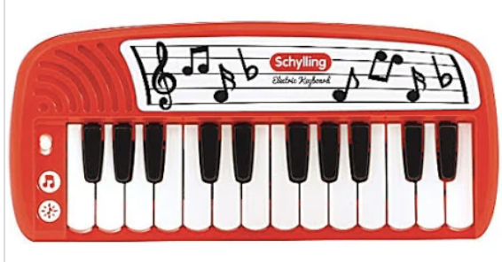
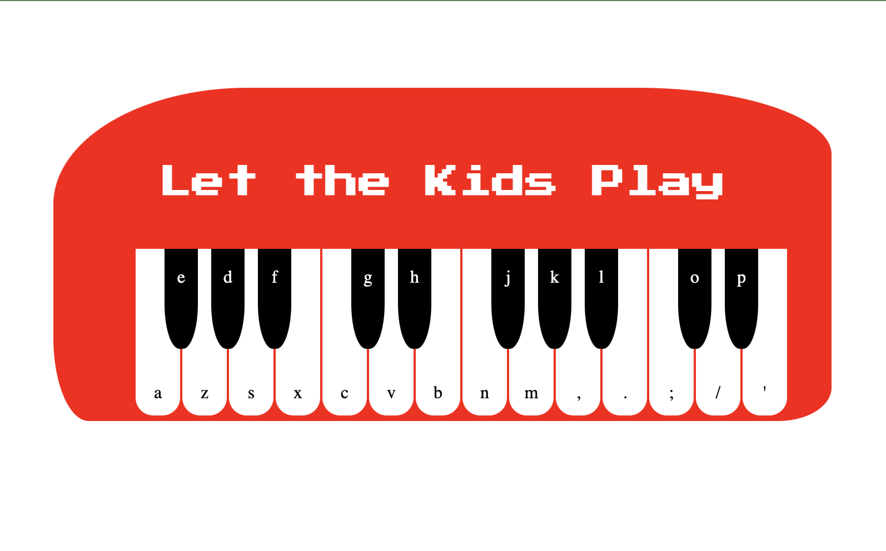

# Building with CSS and Vanilla DOM manipulation

***
## Description
Here is a fun little music making project. It started as an idea to emulate a kids bright colored plastic keyboard. As I build it out it started to evolve. 

Have fun with it! 

***
## Technologies Used

- HTML5
- CSS3
- JavaScript
- Virtual Studio Code
- Git/Github

***
## Inspiration for Keyboard

 

## Deployed version   

    

[Click Here](https://krsnamara.github.io/let-the-kids-play/) to visit deployed app! 
***
## Future enhancements: 

-Have users login and add their own wav files
-Develop a way to record a session
-Drag and drop wav file upload
-Ability for users to add to the wav file sample collection
-Engineer a feed for users to share their sessions